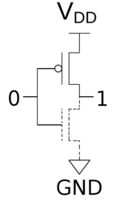
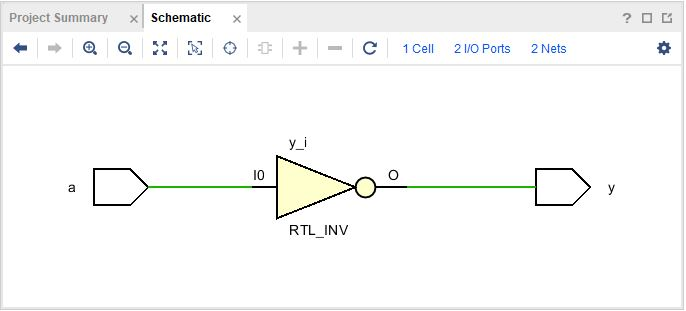
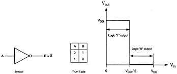
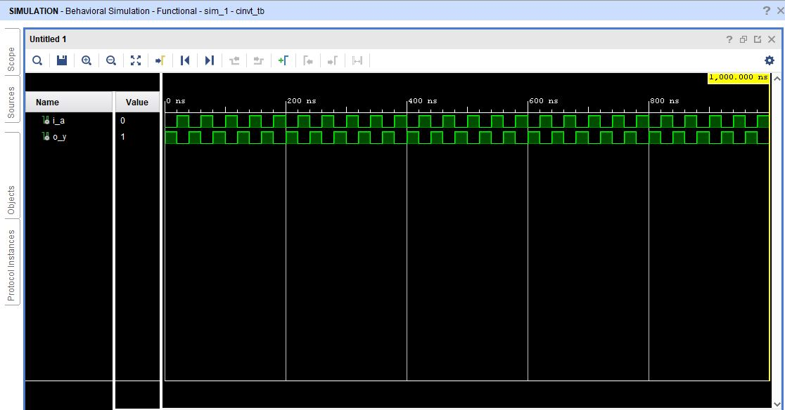

# CMOS Inverter

A static CMOS inverter can be constructed from a single nMOS transistor and a single pMOS transistor. As usual, the pMOS is connected to VDD and nMOS is connected to ground. When the input is LOW, the nMOS transistor is off and the pMOS transistor is on. The output is pulled up to HIGH as it's connected to VDD but not GND. When the input is HIGH, the nMOS transistor is on and the pMOS transistor is off yielding an output that is connected to GND. CMOS inverters are typically used to drive other MOS devices by connecting a capacitor on the output end; the capacitor is charged and discharged during each switch.

## CMOS 

## Circuit Schematic

## Truth table

## VHDL output
