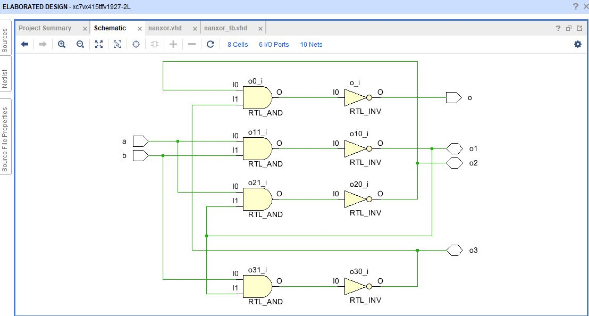
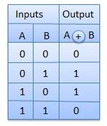
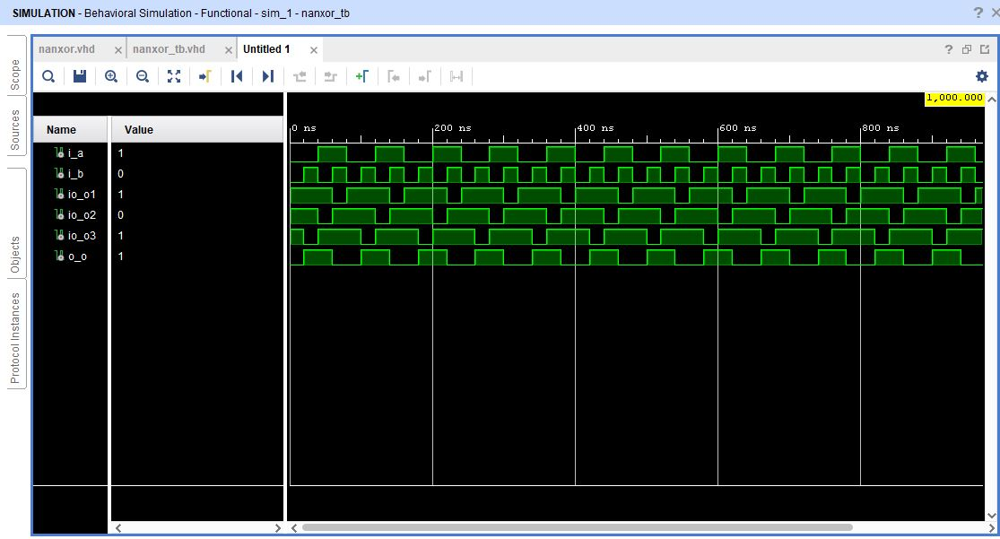

# XOR Gate
XOR or Ex-OR gate is a special type of gate. It can be used in the half adder, full adder and subtractor. The exclusive-OR gate is abbreviated as EX-OR gate or sometime as X-OR gate. It has n input (n >= 2) and one output.

## Circuit Schematics

Implementing Xor using Nand gates:

## Truth Table

Truth Table for XOR gate
 

## VHDL Output

