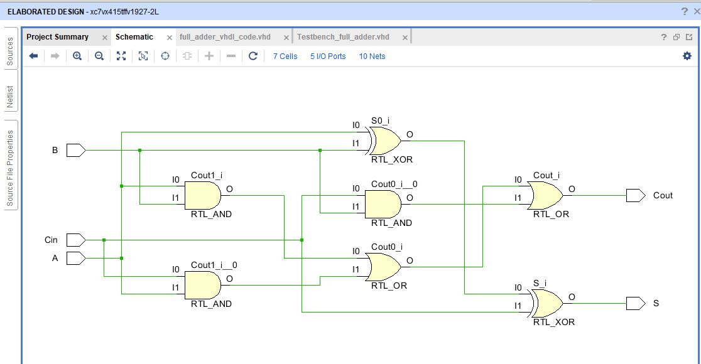
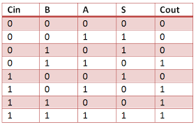
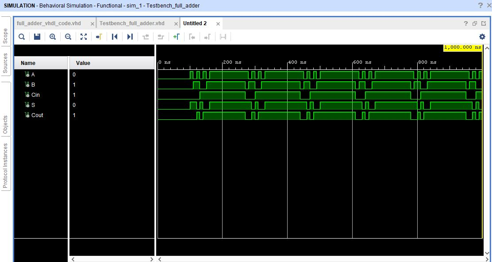

# Full Adder
A full adder is a logical circuit that performs an addition operation on three one-bit binary numbers. The full adder produces a sum of the three inputs and carry value. It can be combined with other full adders 

## Circuit Schematic

## Truth Table

## VHDL Output 
