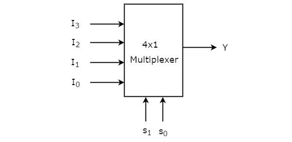
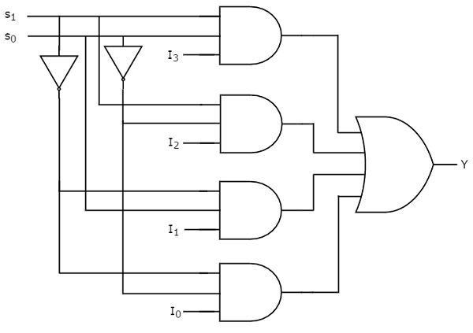
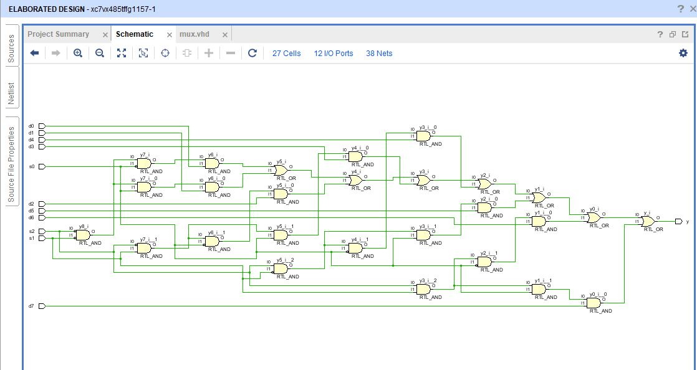
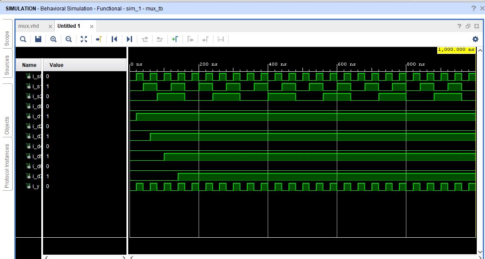

# MULTIPLEXER

Multiplexer is also called as Mux.
Multiplexer is a combinational circuit that has maximum of 2n data inputs, ‘n’ selection lines and single output line. One of these data inputs will be connected to the output based on the values of selection lines.

Since there are ‘n’ selection lines, there will be 2n possible combinations of zeros and ones. So, each combination will select only one data input.

## A 4:1 Multiplexer

## Equivalent Gate Circuit for 4:1 mux

## Circuit Schematics for VHDL 

## VHDL Output
