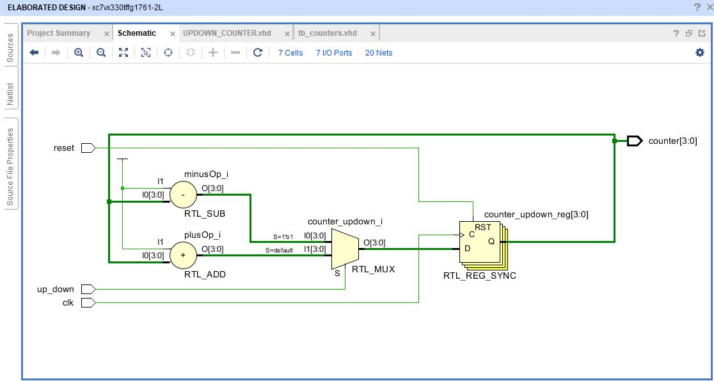
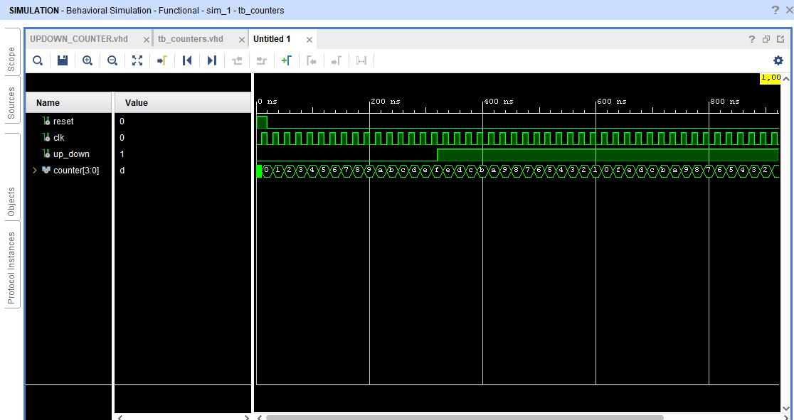

# Up-Down Counters

Counters are used in many different applications. Some count up from zero and provide a change in state of output upon reaching a predetermined value; others count down from a preset value to zero to provide an output state change.

However, some counters can operate in both up and down count mode, depending on the state of an up/down count mode input pin. They can be reversed at any point within their count sequence. Dual purpose ICs such as the TTL 74LS190 and 75LS191 are available which implement both Up and Down count functions.

The counter is decremented or incremented synchronously with the low to high transition of the clock. The counters can be cascaded in high-speed mode.

## Circuit Schematics

## VHDL Output 

